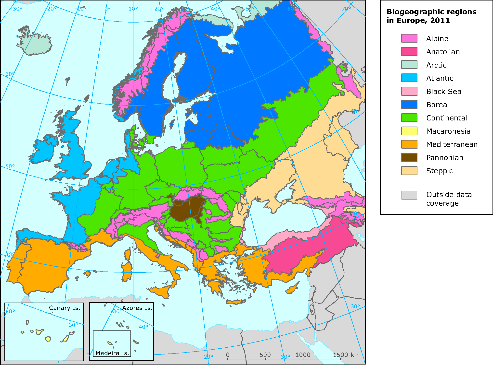
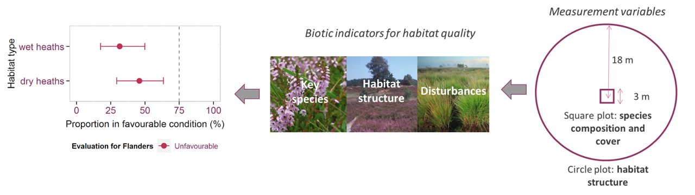

# Beleidscontext

## Natura 2000 habitat

- Europese Habitatrichtlijn
  - Bescherming van habitattypen en soorten van Europees belang
  - Netwerk van Speciale beschermingszones (SBZ): Natura 2000 netwerk
  - Lijst met habitattypen
  
- Vlaanderen
  - ongeveer 66000 ha Natura 2000 habitat (4,8%)
  - 47 habitattypen

## Natura 2000 habitat

- enkele voorbeelden van habitattypen in Vlaanderen

```{r habitattypen, message=FALSE}
library(n2khab)

types_example <- read_types(lang = "nl") %>%
  filter(type %in% c("1330", "2120", "3150", "3260", "4030", "6510", "91E0")) %>%
  filter(typelevel == "main_type") %>%
  select(type, type_name) 
```

```{r, echo=FALSE}
types_example %>%
  kable(booktabs = TRUE) %>%
  kable_styling(font_size = 7)
```


## Natura 2000 habitat

- sommige habitattypen opgesplist in subtypen

```{r}
subtypes_91E0 <-read_types(lang = "nl") %>%
  filter(main_type == "91E0") %>%
  filter(typelevel == "subtype") %>%
  select(main_type, type, type_name) 
```

```{r, echo=FALSE}
subtypes_91E0 %>%
  kable(booktabs = TRUE) %>%
  kable_styling(font_size = 7)
```


## Rapportage

- om de 6 jaar rapportage over staat van instandhouding 
- per habitattype en per biogeografische regio

```{r regions, echo = FALSE, out.width="40%", fig.align='center'}

```

## Rapportage

- Beoordeling Staat van instandhouding (SVI) habitattypen
  - Areaal
  - Oppervlakte
  - Structuur en functies
    - Aandeel habitat met goede kwaliteit
    - Habitattypische soorten
    - Ruimtelijke samenhang
    - Drukken en bedregingen
  - Toekomstperspectieven

## Rapportage

- Beoordeling Staat van instandhouding (SVI) habitattypen
  - Areaal: **Habitatkartering**
  - Oppervlakte: **Habitatkartering**
  - Structuur en functies
    - Aandeel habitat met goede kwaliteit: **Meetnet biotische habitatkwaliteit (MHQ)**
    - Habitattypische soorten
    - Ruimtelijke samenhang
    - Drukken en bedregingen: **MNM**
  - Toekomstperspectieven

- Laatste rapportage in 2019
  - slechts 3 van de 47 habitattypen gunstig (zie [rapport Paelinckx_etal_2019](https://purews.inbo.be/ws/portalfiles/portal/16266937/Paelinckx_etal_2019_RegionaleStaatVanInstandhoudingVoorDeHabitattypenVanDeHabitatrichtlijnRapportageperiode20132018.pdf))
- in 2025 nieuwe rapportage

# Meetnet biotische habitatkwaliteit

## Habitatkwaliteit?

- Indicatoren voor habitatkwaliteit per habitatsubtype: Lokale Staat van Instandhouding (**LSVI**)
  - Vegetatiesamenstelling (sleutelsoorten)
  - Habitatstructuur
  - Verstoring
  
- Per indicator referentiewaarde voor gunstige staat

- Globale uitspraak habitatkwaliteit
  - one out all out
  - habitatrapportage: goede habitatkwaliteit als
    - alle 'zeer belangrijke' indicator gunstig, EN
    - minstens 50 % van de indicatoren gunstig

## Habitatkwaliteit?

- Voorbeeld habitattype *droge heide* (4030) 

```{r, message = FALSE}
library(LSVI)
maakConnectiePool()
lsvi4030 <- geefInvoervereisten(Versie = "Versie 3",
                    Habitattype = "4030",
                    Kwaliteitsniveau = 1) %>%
  select(Criterium, Indicator, Belang, Voorwaarde, Operator, Referentiewaarde)
```

```{r, echo= FALSE}
 lsvi4030 %>%
  kable(booktabs = TRUE) %>% 
  kable_styling(font_size = 7)
```

## Meetnetontwerp

+ Overzicht

```{r meetnet, echo = FALSE, out.width="100%", fig.align='center'}

```
## Meetnetontwerp

+ Steekproef per habitattype
  + exclusief zeer zeldzame (< 10 ha) types
  + verdichting steekproef binnen SBZ-H
  + verdichting steekproef subtypes

+ Steekproefkader gebaseerd op
  + Habitatkaart terrestrische types: [habitatmap_terr](https://zenodo.org/records/13886579)
  + Watervlakkenlaag+habitatkaart: [watersurfaces_hab](https://zenodo.org/records/14621825)
  + Kaart 3260 (riviertype)
  
+ Steekproeftrekking via GRTS
  + ruimtelijk gebalanceerde steekproef
  + Master GRTS voor Vlaanderen: [GRTSmaster_habitats](https://zenodo.org/records/2682323)
  
## Meetnetontwerp  

+ Steekproefgrootteberekening: zie rapport [Westra et al. 2022](https://publicaties.vlaanderen.be/view-file/52364)

```{r, echo = FALSE}
steekproefgrootte <- data.frame(categorie = c("open terrestrische habitats", "boshabitats", "stilstaande wateren", "stromende wateren"),
                                meetcyclus = c(6, 12, 6, 6),
                                steekproefgrootte = c(1460, 950, 250, 100))

steekproefgrootte %>%
  kable(booktabs = TRUE) %>%
  kable_styling()
```


## Implementatie meetnet

+ Gegevensinzameling
  + ANB: boshabitats, heide en 6510
    + synergie met Vlaamse bosinventarisatie
  + INBO: overige habitattypen
    + synergie met Schelde monitoring MONEOS
  
+ Start 1ste meetcyclus: 2014-2018

+ Start 2de meetcyclus: 2022-2023 
  

